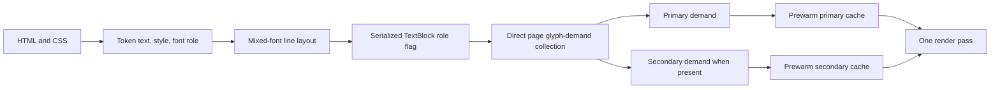

# Performance-First Secondary Monospace Font Design

## Goal

Add an independently selectable SD-card monospace font for technical EPUB content while preserving the current single-font fast path and limiting mixed-font page-render overhead to 10% on X3 hardware.

This design takes the user-visible behavior from CrossPoint's `secondary-inline-font` specification but does not reuse its implementation. That implementation extended the fake scan-render cache warmup to multiple SD fonts and produced repeated overflow glyph reads, approximately 29-second first-page rendering in the recorded stress case, and unstable cache behavior. CrossInk will use explicit font-role metadata, direct glyph-demand collection, independent caches, and one real render pass.

## Scope and Reading Benefit

Technical books commonly distinguish source code, commands, identifiers, keyboard input, and program output with a monospace face. Preserving that distinction materially improves focused reading and is within `SCOPE.md`'s reading mission.

The feature covers:

- an independent secondary SD-card family selected from installed fonts;
- `<code>`, `<kbd>`, `<samp>`, `<tt>`, and `<pre>` semantic elements;
- CSS generic `font-family: monospace` when publisher styles are enabled;
- inline and block monospace content;
- mixed primary and secondary text on one line;
- bold, italic, bold-italic, underline, strikethrough, superscript, and subscript style preservation;
- built-in or SD primary fonts;
- SD secondary fonts, including dual-SD primary/secondary operation;
- deterministic fallback to the primary font if the secondary family is unavailable or cannot be loaded.

The feature does not add arbitrary EPUB font embedding, per-book font mapping, more than two reader font roles, automatic language-specific fallback, or a bundled monospace family.

## Hard Characteristics

### Performance

- A configured secondary font adds no secondary prewarm, SD read, or cache operation on prose-only pages.
- Prose-only median CPU render time remains within 2% of the secondary-disabled control.
- Pages containing secondary tokens remain within 10% of the same page rendered entirely with the primary font.
- The 10% calculation uses `prewarm + bw_render`; physical e-ink refresh is excluded because it is constant and would hide CPU and SD regressions.
- The implementation performs one actual render pass. It does not add a font-specific render pass or switch caches per inline font run.
- Cache-miss or low-memory handling must not degrade into repeated per-glyph SD reads.

### Memory

- No second framebuffer or duplicate full-page text model.
- Font role occupies one existing serialized token-flag bit.
- A mixed `TextBlock` adds at most one flag byte per token; a prose-only block retains the flag-free representation.
- Per-page glyph demand uses a bounded `ScratchWorkspace` lease, not stack storage or repeated heap growth.
- Dual SD caches remain independently owned and bounded.
- Dual-SD prewarm must preserve enough largest-free-block capacity for section inflate and grayscale rendering. Failure of that gate requires redesign, not on-demand-read fallback.

### Correctness

- Font role survives parsing, BiDi reordering, line breaking, hyphenation metadata, serialization, deserialization, and rendering.
- Width, kerning, ascender, descender, underline, strikethrough, and background measurements use the token's resolved font ID.
- A mixed-font line uses the maximum ascender/descender required by either family, preventing clipping.
- Bionic splitting is suppressed for secondary tokens so identifiers and code remain exact. Other inline styles remain intact.
- One SD reader is used at a time. Primary and secondary prewarm occur sequentially, and all files are explicitly closed before the next operation.

## Architecture

### Font role

Introduce an exhaustive two-value role:

```cpp
enum class FontRole : uint8_t {
  Primary = 0,
  Secondary = 1,
};
```

`FontRole` is separate from `EpdFontFamily::Style`. The parser's inline-style stack carries both style and role. `ParsedText` maintains a role vector in lockstep with words and all reorder/line scratch vectors. `TextBlock` stores `Secondary` in an unused word-flag bit; absence of any word flags continues to imply primary role and no per-token flag arena.

A small resolver maps role to the active primary or secondary font ID. `0` or an unavailable secondary ID maps to primary. Callers pass the two IDs as one explicit render/layout context rather than adding unrelated optional integer parameters throughout the code.

### Parser activation

The parser enters secondary role for the semantic elements `code`, `kbd`, `samp`, `tt`, and `pre`. It also enters secondary role for a CSS generic monospace family when publisher styles are enabled. Nested inline elements inherit role. A nested explicit non-monospace generic family may restore primary role only where current CSS handling already preserves that declaration; no arbitrary EPUB embedded font is loaded.

Closing an element restores the previous role from the same fixed-depth inline stack used for other inherited parser state. Overflow follows the parser's existing guarded stack behavior.

### Mixed-font layout

All token-width operations resolve the token font before measuring. This includes ordinary width, soft-hyphen variants, bionic metadata for primary tokens, natural gaps, kerning, guide-dot placement, inserted hyphens, and table-cell line layout.

The line extractor carries roles through logical and visual order. A line computes vertical metrics from all participating roles. `TextBlock::render` resolves the font once per token, then uses that ID consistently for text, decorations, backgrounds, guide dots, and fallback glyph handling.

### Section cache

Bump `SECTION_FILE_VERSION`. The section header records both deterministic font IDs. Cache load rejects a section when either ID differs. Serialized `TextBlock` word flags carry secondary role without adding a separate role array. Existing sections fail version validation and rebuild cleanly; there is no migration shim.

### Dual SD font ownership

Refactor `SdCardFontManager` from one implicit loaded family to two explicit role slots. Each slot owns at most one selected point-size file, deterministic ID, `SdCardFont`, and family name. Loading or changing one slot does not unload the other.

The public operations are role-specific: ensure loaded, resolve ID, release cache, unload, and query family/size. The manager serializes SD access through the existing HAL and never holds two file handles open. Network and low-memory release paths visit both slots in deterministic order.

The reader-format menu adds an independent “Monospace font” row using the existing font registry. “Disabled” is the default. Selection persists independently from the primary SD family. The UI does not add a new screen.

## Direct Glyph-Demand Collection

### Why the scan render is removed

CrossInk currently invokes `Page::renderText` in `FontCacheManager::ScanMode` to concatenate text, prewarms one font ID, and then renders again. That mechanism cannot distinguish two token roles and causes rendering logic, font lookup, and traversal to run twice.

A behavior-preserving prerequisite replaces the fake scan render with direct demand collection for the existing single-font path before secondary roles are enabled. Its timing and framebuffer output are verified independently.

### Demand format

A glyph demand entry contains a codepoint and the exact requested style mask. Deduplication merges style bits for repeated codepoints. Demand is partitioned by `FontRole` in one bounded `ScratchWorkspace` lease. The target capacity remains aligned with `SdCardFont::MAX_PAGE_GLYPHS`; overflow is explicit, logged, and fails prewarm rather than silently causing on-demand glyph reads.

`Page`, `PageLine`, table fragments, and `TextBlock` expose direct collection methods that traverse serialized tokens without drawing or font measurement. Prose-only pages never initialize or prewarm secondary demand.

`FontCacheManager` accepts role-separated demand and prewarms each participating font once. Built-in and SD font backends receive exact per-codepoint/per-style demand instead of one concatenated string combined with a page-wide style mask. Primary and secondary SD files are opened and closed sequentially. Their prepared caches remain resident for the single render pass.

Collector scratch is released before framebuffer storage, grayscale work, or the next memory-heavy stage.

## Data Flow



## Failure Handling

- Secondary disabled: role resolves to primary and no secondary manager/cache work occurs.
- Selected family missing at startup or after registry refresh: clear only the secondary selection, persist the change, and render with primary.
- Secondary load failure: log the family and point size, clear the secondary slot, and continue with primary.
- Scratch demand overflow, prewarm OOM, or insufficient largest-free-block capacity: abort secondary cache preparation for that page and render secondary tokens with primary. Do not enter overflow glyph reads.
- Primary load failure retains existing reader fallback behavior.
- Section cache mismatch or old version triggers normal section rebuild.

## Performance Verification

Use one X3, one firmware build, fixed font size, fixed render mode, and fixed refresh settings. Exclude cold book indexing unless the scenario specifically measures section creation. Record at least 20 warm page turns and compare medians.

### Scenario A: prose fast path

- Secondary disabled versus secondary configured on a page with no secondary tokens.
- Pass: no secondary prewarm/SD reads and median CPU render difference at most 2%.

### Scenario B: built-in primary plus SD secondary

- Deterministic technical page containing inline and block code.
- Pass: median `prewarm + bw_render` overhead at most 10%; one prewarm per participating font; no overflow reads.

### Scenario C: SD primary plus SD secondary

- Two distinct SD families on the same technical fixture.
- Pass: median `prewarm + bw_render` overhead at most 10%; no low-memory fallback; no repeated per-glyph reads; stable largest free block.

### Scenario D: cache stress

- Mixed regular/bold/italic code, punctuation, long identifiers, Unicode prose, tables, forward/back turns, and repeated pages.
- Pass: bounded cache memory, no latency growth across repetitions, no handle concurrency failure, and framebuffer output remains stable.

Use `MemoryBudget::snapshot`, existing `FontCacheManager`/`SdCardFont` stats, `firmware_size_history.py`, and the existing memory profiling scripts. Record baseline and feature firmware flash/RAM sizes.

## Correctness Verification

Automated tests cover:

- semantic and CSS activation, including nested restoration;
- role/style independence;
- token-width and mixed-line wrapping with distinct font metrics;
- role preservation through BiDi order, soft hyphens, inserted hyphens, and tables;
- bionic suppression for secondary tokens;
- `TextBlock` role-flag packing and serialization;
- section cache version and both-font invalidation;
- direct collector prose fast path;
- exact per-role/per-style demand separation;
- one prewarm per participating font;
- independent dual-SD lifecycle and explicit file closure;
- missing/unloadable secondary fallback;
- bounded demand overflow behavior.

A deterministic technical EPUB fixture covers inline code, preformatted code, CSS monospace, mixed emphasis, Unicode, wrapping, tables, and repeated pages. Simulator framebuffer captures verify appearance. X3 logs provide the authoritative latency, SD-read, heap, and largest-free-block evidence.

## Implementation Sequence

1. Add the deterministic technical fixture and timing/memory baseline.
2. Replace the single-font fake scan render with direct demand collection; verify unchanged output and non-regressed timing.
3. Add `FontRole` to parser, layout, packed line representation, and section cache under tests.
4. Add role-specific dual SD manager ownership and settings.
5. Add role-separated demand prewarm and one-pass mixed rendering.
6. Run correctness, flash/RAM, simulator, and X3 performance gates.

Each step must leave the current single-font reader functional and independently verifiable. The feature does not ship if the dual-SD scenario exceeds 10% or requires per-glyph overflow reads.
